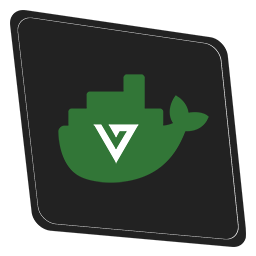

<p align="center"></p>

<h1 align="center">alt:V server for Docker</h1>

A Docker image providing the alt:V server.

## About

The Docker image for the alt:V server comes in three different versions:

- with no modules
- with the NodeJS module
- with the C# module
- with both modules (NodeJS and C#)

## Usage

Visit the image on [Docker Hub](https://hub.docker.com/r/eisengrind/altv-server).

### No modules

Starts the latest release of the server with no modules.

```sh
docker run -it eisengrind/altv-server:release
```

### NodeJS module

Starts the latest release of the server with the NodeJS module

```sh
docker run -it eisengrind/altv-server:release-nodejs
```

### C# module

Starts the latest release of the server with the C# module

```sh
docker run -it eisengrind/altv-server:release-dotnet
```

### Both modules (NodeJS and C#)

Starts the latest release of the server with both modules

```sh
docker run -it eisengrind/altv-server:release-nodejs-dotnet
```

## Build

For the `$build` and `$branch` variables you have to enter the regarding alt:V versioning values.

**`$build`** represents the build number of the server source files. E.g. **`$build=1098`**

**`$branch`** represents the branch where the server build was released. E.g. **`$branch=release`**

### No modules

```sh
docker build . --build-arg BRANCH=$branch -t eisengrind/altv-server:$build
```

### NodeJS module

```sh
docker build . --build-arg BRANCH=$branch -t eisengrind/altv-server:$build
docker build . -f ./nodejs.Dockerfile --build-arg BUILD=$build --build-arg BRANCH=$branch -t eisengrind/altv-server:$build-nodejs
```

### C# module

```sh
docker build . --build-arg BRANCH=$branch -t eisengrind/altv-server:$build
docker build . -f ./dotnet.Dockerfile --build-arg BUILD=$build --build-arg BRANCH=$branch -t eisengrind/altv-server:$build-dotnet
```

### Both modules (NodeJS and C#)

```sh
docker build . --build-arg BRANCH=$branch -t eisengrind/altv-server:$build
docker build . -f ./dotnet.Dockerfile --build-arg BUILD=$build --build-arg BRANCH=$branch -t eisengrind/altv-server:$build-dotnet
docker build . -f ./nodejs-dotnet.Dockerfile --build-arg BUILD=$build-dotnet --build-arg BRANCH=$branch -t eisengrind/altv-server:$build-nodejs-dotnet
```

## Using custom vehicle data

To use custom vehicle data, you can mount a volume to the directory `/opt/altv/data/`. By using the volume you can then overwrite the `vehmodels.bin` and `vehmods.bin` files.

## Usage with a custom Dockerfile

Most of the time if you are using containers, especially images, correctly, you will create a customized Docker image. For example by adding resources to a container which will represent a current version of your files.

You can use this images as a base for your future customizations:

```Dockerfile
FROM eisengrind/altv-server:release-nodejs

RUN mkdir -p /opt/altv/resources/test-resource
```

This example, however, just creates an empty folder within the alt:V resources folder.

### Note on Docker caching

We provide two different kinds of tags for the alt:V Docker image: specific and non-specific image tags.

In general, this means that specific tags represent a unique alt:V build version whereas a non-specific tag such as `release...` or `dev...` represents the latest build number of the regarding branch.

Thus, once an image with a non-specific tag is pulled, this image will not automatically get updated by Docker unless you remove and pull the image again from Docker Hub.

This is why we provide specific tags. Those kind of tags do explicitly not lead to a caching problem, because specific tags are not meant to be, once they are published, changed.

**tl;dr Keep in mind that you should always specify a specific tag in a Dockerfile.**

## License

See the [LICENSE](https://github.com/eisengrind/docker-altv-server/blob/master/LICENSE)-file for more information.
